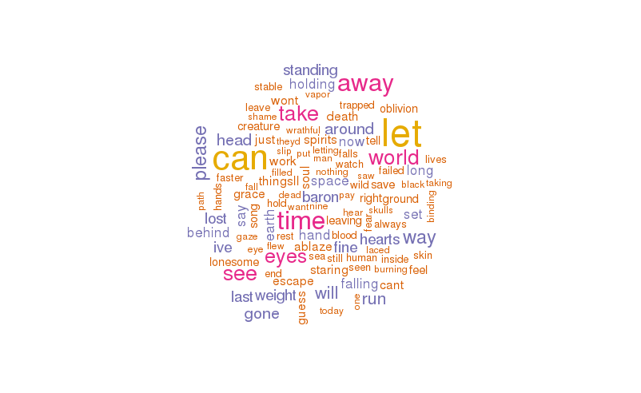

# lyritical
Analysis of song and artist lyrics in R - just for fun!!

The idea came to me as I was driving listening to Spotify - I wonder how many times the word *tonight* has been mentioned in this song? What about by this artist in general? There was only one way to find out, write a few lines of `R` script!

`lyritical` was born, part **lryi**cs, part analy**tical**, all just because.

## What does it do?

Currently there are functions to explore the number of times words are used in a given song, or by a given artist (so across all of their songs). `lyritical` scraps lyrics from lyrics.com (*I will look to expand this later*) using the `rvest` package.

### song_wordcloud

...in development...

### artist_wordcloud

This function takes an artist name as input and pulls in all available lyrics and finally generates a wordcloud showing the prevalence of words used by said artist. Alongside the wordcloud there is also a basic reporting system which currently returns:

  - number of songs listed for the artist
  - number of songs with lyrics available
  - 

example:

`artist_wordcloud(artist = 'Mastodon', verbose = F, max.words = 300)`

  - *artist*: your favourite artist (obviously)  
  - *verbose*: display a scrolling list of all songs as they are scraped from lyrics.com  
  - *max.words*: how many words should the wordcloud render?

    there were 106 songs found on lyrics.com for Mastodon  
    12 songs had lyrics available  
    the average number of words per song for Mastodon is 174  
    the most words per song for Mastodon is 533  
    the least words per song for Mastodon is 62  

## Things to do

  - convert to realtime shiny app
  - interactive wordclouds? (maybe using D3 or htmltools) 
  - work on reducing the number of 'filler' words reported (can, the, ... etc.)
  - add additional sources of lyrics
    + this adds complexity as there will need to be a way to removed duplicates

## Dependencies

There are currently 4 `R` packages required:

  - rvest
  - magrittr
  - wordcloud
  - XML