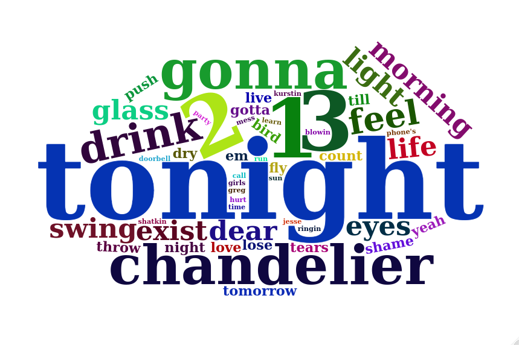
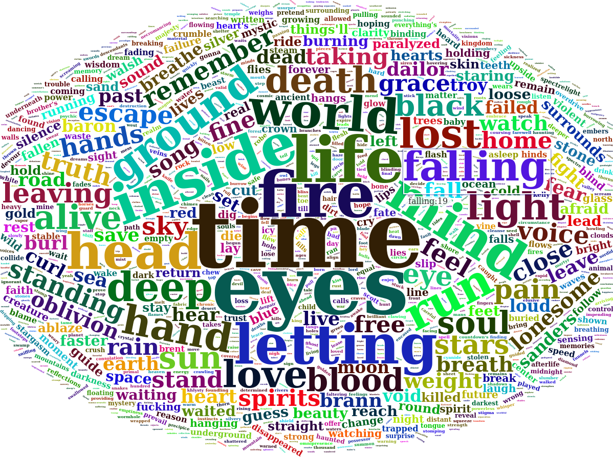

# lyritical
Analysis of song and artist lyrics in R - just for fun!!

The idea came to me as I was driving listening to Spotify - I wonder how many times the word *tonight* has been mentioned in this song? What about by this artist in general? There was only one way to find out, write a few lines of `R` script!

`lyritical` was born, part **lryi**cs, part analy**tical**, all just because.

## What does it do?

Currently there are functions to explore the number of times words are used in a given song, or a given album. `lyritical` originally used web-scraping to pull lyrics from lyrics.com using the `rvest` package. However, due to changes in lyrics.com which 'broke' the original scripts, and the development of a really nice R package in the form of [geniusR](https://github.com/JosiahParry/geniusR), `lyritical` has been reborn.

I now use [geniusR](https://github.com/JosiahParry/geniusR) to do the heavy lifting and pull data from [genius.com](https://genius.com/), `tidytext` helps with formatting and removing of stop-words and `wordcloud2` is used to create the actual image. I believe this is a nicer workflow and should make life easier when I get around to developing this into a Shiny app.

## Dependencies

There are currently 4 `R` packages required, please make sure these are installed before running `lyritical`:

  - `geniusR`
  - `tidyverse`
  - `tidytext`
  - `wordcloud2`
  
The current development for the artist function requires these additional packages to be installed:

  - `XML`
  - `RCurl`

### song_wordcloud

Provide the artist and the song title and this function will generate a wordcloud, allowing direct visualisation of most present lyrics. This will also return the number of words in the song, the number of unique words and the word that appears the most, as well as the non stop-word that appears most (*after filtering 'junk' words*).

example:

    song_wordcloud(artist = 'sia', song = 'chandelier')

    Wordcloud for the song "chandelier" by the artist "sia".
    There are 380 words in this song, and 95 of these are unique.
    The word "im" appears most at 23 times. For non-stop words "tonight" appears "16" times in this song.



### album wordcloud

Provide the artist and album title and this function will generate a wordcloud, allowing direct visualisation of most present lyrics across the whole album. Additional statistics will be added in the future.

    album_wordcloud(album = 'master of puppets', artist = 'Metallica')
    
    Wordcloud for "master of puppets" by "Metallica".
    There are 8 tracks on this album.


### artist_wordcloud

***NOTE: this function is currently broken. I am working on overhauling it and will update when it is ready again.***

This function takes an artist name as input and pulls in all available lyrics and finally generates a wordcloud showing the prevalence of words used by said artist. Alongside the wordcloud there is also a basic reporting system which currently returns:

  - number of songs listed for the artist
  - number of songs with lyrics available
  - average number of words per song
  - most words per song (reports the song)
  - least words per song (reports the song)

example:

`artist_wordcloud(artist = 'Mastodon', verbose = F, max.words = 300)`

  - *artist*: your favourite artist (obviously)  
  - *verbose*: display a scrolling list of all songs as they are scraped from lyrics.com  
  - *max.words*: how many words should the wordcloud render?



    there were 106 songs found on lyrics.com for Mastodon  
    12 songs had lyrics available  
    the average number of words per song for Mastodon is 174  
    the most words per song for Mastodon is 533 (last baron) 
    the least words per song for Mastodon is 62 (creature lives)  

The below code is my current implementation to 'grab' all albums for a given artist from genius.com:

```R
## get all genius albums for a given artist
## needs some more work as some artists don't have all albums listed
require(RCurl)
require(XML)

artist <- 'Chevelle'

base_url <- "https://genius.com/artists/"
query <- paste(artist, sep = "-") %>% str_replace_all(" ", "-")
url2 <- getURL(paste0(base_url, query))
parsed <- htmlParse(url2)
links <- xpathSApply(parsed,path = "//a",xmlGetAttr,"href")
links <- links[grep('https://genius.com/albums/', links)] 
albums <- unlist(lapply(strsplit(links, split = '/'), `[[`, 6))
albums %>% unique()
```

## Things to do

  - [x] ~~overhaul code to work with geniusR and wordcloud2 (so tidy formatting)~~
  - [ ] fix `artist_wordcloud` function
    + [x] ~~explore ways of scrapping album links from genious.com~~
  - [ ] convert to realtime shiny app
  - [ ] interactive wordclouds? (maybe using D3 or htmltools) 
  - [ ] work on reducing the number of 'filler' words reported (can, the, ... etc.)
  - [ ] add additional sources of lyrics
    + [ ] this adds complexity as there will need to be a way to removed duplicates
  - [ ] could get track metadata (length etc) and compare to other statistics
  - [ ] add a cache system where there is a check for previous artist searches
    + [ ] if artist has a csv file saved load and generate wordcloud, if not run as usual
    + [ ] add an overwrite argument to the function 
